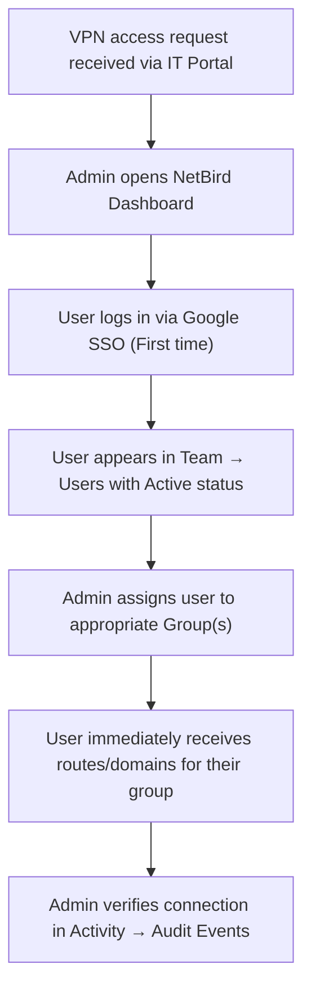

# NetBird — Administrator Guide

**Status:** Active  
**Last Updated:** 2026-09-25  
**Managed by:** TechOps / DevOps  
**Dashboard:** `https://netbird.b3networks.com`

---

> [!NOTE]
> **Summary:** This guide is intended for DevOps and TechOps administrators who provision, maintain, and audit B3 Networks' self-hosted NetBird Zero Trust VPN. It covers user provisioning, group assignments, routing peer setup, backup/restore procedures, and the user offboarding lifecycle.
>
> **Audit Coverage:** Remote access and network security controls under ISO 27001 and SOC 2 (A.6.7, A.8.20, A.8.22, CC6.6).

---

## 1. Background

- NetBird is B3 Networks' self-hosted Zero Trust VPN built on the WireGuard protocol.
- Users authenticate via Google Workspace SSO (`@b3networks.com`) — eliminating manual `.conf` file and private key distribution.
- Web Management Dashboard: `https://netbird.b3networks.com`
- Twingate is retained in parallel for IMDA SSIR compliance requirements.

---

## 2. Scope

- DevOps/TechOps administrators managing user provisioning, group assignments, routing peer onboarding, and backup/restore.
- End-user installation and connectivity instructions are covered in [NetBird User Guide](NetBird-User-Guide.md).
- Complete server specs, subnets, and routing topology are covered in [NetBird Configuration Reference](NetBird-Config.md).

---

## 3. Administrator Workflow — User Provisioning



---

## 4. User Provisioning Procedure

### Step 1 — First-Time User Login
1. Direct the user to the NetBird web portal: `https://netbird.b3networks.com`.
2. The user clicks **Login with Google** and authenticates using their corporate `@b3networks.com` Google account.
3. Upon successful authentication, the user account is automatically provisioned in **Team → Users** with status `Active`.
4. No static key generation or `.conf` file handling is required.

### Step 2 — Group Assignment
1. Navigate to **Team → Users** in the NetBird Dashboard.
2. Select the target user $\rightarrow$ Click **Auto-assigned Groups**.
3. Assign the user to the appropriate group based on their role:
   - **`Common`**: Assigned to all general staff. Grants access to internal web portals (`*.internal.b3networks.com`) and dev WebSocket services (`wss-dev`).
   - **`DevOps`**: Assigned to DevOps engineers. Grants full subnet access to AWS (`172.21.0.0/16`, `172.22.0.0/16`, `10.8.0.0/16`) and GCP (`10.31.0.0/16`, `10.32.0.0/16`).
   - **`Ops`**: Assigned to TechOps engineers. Grants access to AWS Primary VPC (`172.21.0.0/16`) and Ops-tool VPC (`10.8.0.0/16`).
   - **`nexus-ux-team`**: Assigned to QA and UX testers. Grants access to GCP Nexus Prod (`10.32.0.0/16`).
   - **`B3-Partner`**: Assigned to engineers requiring partner egress routing.

### Step 3 — Verification
1. Open **Activity → Audit Events** in the dashboard to confirm the login and group assignment events.
2. Ask the user to verify access by navigating to an internal service (e.g., `https://kibana.internal.b3networks.com`).

---

## 5. Routing Peer Onboarding Procedure

When setting up a new EC2 or GCP VM to act as a Routing Peer:

1. **Generate Setup Key:**
   - In NetBird Dashboard, navigate to **Settings → Setup Keys**.
   - Click **Add Setup Key** $\rightarrow$ Name: e.g. `gcp-nexus-routing-peer` $\rightarrow$ Type: **Reusable** $\rightarrow$ Auto-assigned Groups: `Routing Peers` $\rightarrow$ Save.

2. **Configure Host Kernel & Packages (on the Gateway VM):**
   ```bash
   # Enable IPv4 packet forwarding
   sudo sysctl -w net.ipv4.ip_forward=1
   echo "net.ipv4.ip_forward = 1" | sudo tee /etc/sysctl.d/99-netbird.conf
   sudo sysctl -p /etc/sysctl.d/99-netbird.conf

   # Ensure iptables is installed
   sudo dnf install -y iptables || sudo apt-get install -y iptables
   ```

3. **Install & Connect NetBird:**
   ```bash
   # Install NetBird agent
   curl -fsSL https://pkgs.netbird.io/install.sh | sh

   # Connect using B3 Management URL and Setup Key
   sudo netbird up \
     --management-url https://netbird.b3networks.com \
     --setup-key <SETUP_KEY>
   ```

4. **Assign Network Route on Dashboard:**
   - In NetBird Dashboard, go to **Networks** $\rightarrow$ Select or create the network.
   - Set the Routing Peer to the newly connected instance.
   - Define the Network Resource (e.g., `10.32.0.0/16` or `*.internal.b3networks.com`).
   - Ensure **Masquerade = Enabled**.

---

## 6. Backup & Restore Procedures

### 6.1 Automated Backup Schedule
- **Schedule:** Automated daily backup via cron at **02:00 VNT** on the Management EC2 (`172.21.134.27`).
- **Retention Period:** 7 days.
- **Backup Directory:** `/home/ec2-user/backups/`.
- **Database Dump Format:** `netbird_YYYYMMDD_HHMMSS.sql`.

### 6.2 Manual Backup
```bash
# SSH into Management Server (172.21.134.27)
ssh ec2-user@172.21.134.27
/home/ec2-user/backup-netbird.sh
```

### 6.3 Disaster Recovery Restore Procedure
```bash
# 1. Stop management service
cd /home/ec2-user
docker compose stop netbird-server

# 2. Restore SQLite or PostgreSQL database
# (If SQLite):
cp /home/ec2-user/backups/<BACKUP_FILE>.db /var/lib/netbird/store.db

# (If PostgreSQL):
docker exec -i netbird-postgres psql -U netbird netbird < /home/ec2-user/backups/<BACKUP_FILE>.sql

# 3. Restart management service
docker compose start netbird-server
```

---

## 7. User Offboarding Procedure

When an employee or contractor departs B3 Networks:

1. **Disable Google Workspace Account:**
   - Suspend/disable the user's account in Google Admin Console.
   - The user immediately loses SSO authentication to NetBird; token refresh will fail.
2. **Remove Registered Peer Devices:**
   - In NetBird Dashboard $\rightarrow$ **Peers → User Devices**.
   - Search for the departed user's email address.
   - Click the three dots `⋮` on each device and select **Delete**.
3. **Revoke User Account in NetBird:**
   - Go to **Team → Users** $\rightarrow$ Click on the user $\rightarrow$ Select **Delete User**.

---

## 8. Administrator Troubleshooting & FAQ

**Q: User receives "User Approval Pending" on login?**  
**A:** Check **Settings → Authentication** $\rightarrow$ Verify whether **User Approval Required** is enabled. If enabled, manually approve the user in **Team → Users**.

**Q: Routing Peer shows disconnected or offline in Dashboard?**  
**A:** SSH into the routing peer VM, check service status with `sudo systemctl status netbird`, and re-authenticate if necessary:
```bash
sudo netbird up --management-url https://netbird.b3networks.com --setup-key <KEY>
```

**Q: Routing Peer connects but does not forward traffic into the VPC?**  
**A:** Verify that `sysctl net.ipv4.ip_forward` is set to `1` and verify that iptables contains the `NETBIRD-RT-NAT` MASQUERADE chain:
```bash
sudo iptables -t nat -L NETBIRD-RT-NAT -n -v
```

---

# Contact Points

- TechOps
  - Levi Nguyen (levinguyen@b3networks.com)
  - Luk Huynh (luk@b3networks.com)
- DevOps
  - Hieu Dao
  - Sang Ngo
  - Vinh Dang
  - Huy Nguyen
