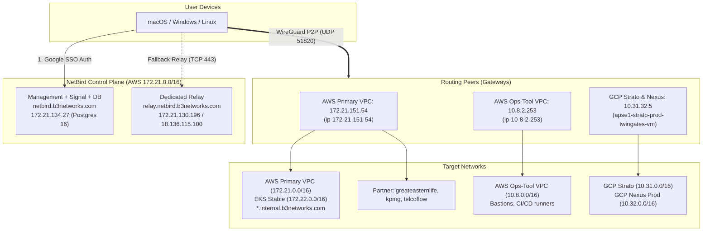

# NetBird — Configuration Reference

**Dashboard:** `https://netbird.b3networks.com`  
**Status:** Active Production  
**Managed by:** TechOps / DevOps  

> **In short** — Authoritative technical reference for B3 self-hosted NetBird: server specs, database, routing peers, VPC subnets, and access policies.

---

## 1. Architecture Topology



---

## 2. Server Infrastructure

| Role | Instance ID | Private IP | Public IP | Specs / OS | DNS Endpoint |
|---|---|---|---|---|---|
| **Management + Signal** | `i-0ebee8d9ae0102850` | `172.21.134.27` | `13.250.164.169` | `t4g.medium` (AL2023) | `netbird.b3networks.com` |
| **Relay Server** | `i-09b9ff45ef4ed866f` | `172.21.130.196` | `18.136.115.100` | `t4g.medium` (AL2023) | `relay.netbird.b3networks.com` |

### Management Docker Stack (`/home/ec2-user/docker-compose.yml`)

* **Traefik (`traefik:v3.6`):** Reverse proxy & Let's Encrypt TLS on ports `80` & `443`.
* **Server (`netbirdio/netbird-server`):** Management API & Signal on port `3478/udp` (STUN).
* **Database (`postgres:16`):** Dedicated PostgreSQL container on port `5432` (`netbird_postgres_data`).
* **Proxy (`netbirdio/reverse-proxy`):** Port `51820/udp` & `8443/tcp`.
* **Security (`crowdsec:v1.7.7`):** Brute-force protection.
* **Internal Docker Subnet:** `172.30.0.0/24` (Traefik IP: `172.30.0.10`).

### Critical Settings (`/home/ec2-user/config.yaml`)
```yaml
store:
  engine: "postgres"
  postgresConnection: "host=netbird-postgres port=5432 dbname=netbird user=netbird ... sslmode=disable"
stuns:
  - uri: "stun:stun.l.google.com:19302" # Workaround for bug #6324
relays:
  addresses: ["rels://relay.netbird.b3networks.com:443"]
  credentialsTTL: "12h"
```

---

## 3. Database & Backup Runbook (On-Call)

* **Cron:** `0 2 * * *` (Daily at 02:00 AM)
* **Script:** `/home/ec2-user/backup-netbird.sh`
* **Dir:** `/home/ec2-user/backups/` (`netbird_YYYYMMDD_HHMMSS.sql`, 7-day retention)
* **Log:** `/var/log/netbird-backup.log`

### Quick Check for DevOps On-Call
```bash
# 1. Check last night's backup
tail -n 10 /var/log/netbird-backup.log

# 2. View backup files
ls -lh /home/ec2-user/backups

# 3. Run manual backup (before changes)
/home/ec2-user/backup-netbird.sh

# 4. Count users and peers
docker exec -i netbird-postgres psql -U netbird -d netbird \
  -c "SELECT COUNT(*) AS active_peers FROM peers; SELECT COUNT(*) AS total_users FROM users;"
```

---

## 4. Security Groups & Firewall Ports

| Target Server | Port | Protocol | Source | Purpose |
|---|---|---|---|---|
| **Management** | `80`, `443` | TCP | `0.0.0.0/0` | Web Dashboard, API, SSO Auth |
| | `3478` | UDP | `0.0.0.0/0` | STUN discovery |
| | `51820` | UDP | `0.0.0.0/0` | WireGuard reverse proxy |
| **Relay** | `443` | TCP | `0.0.0.0/0` | WebSocket Relay fallback tunnel |
| | `3478` | UDP | `0.0.0.0/0` | STUN discovery |
| | `80` | TCP | `0.0.0.0/0` | Let's Encrypt challenge |
| **Routing Peers** | `51820` | UDP | `0.0.0.0/0` | Direct WireGuard P2P from client laptops |
| **Internal Targets** | App ports (`8080`, `3306`...) | TCP | Peer Private IP / Subnet | Target services access |

---

## 5. Routing Peers (Gateways)

| Node | Private IP | Target Subnets / Resources | NAT |
|---|---|---|:---:|
| **`netbird-routing-peer-hoiio`** | `172.21.151.54` | • `172.21.0.0/16` (Primary Prod VPC)<br>• `172.22.0.0/16` (EKS Stable / `wss-dev`)<br>• `172.23.0.0/16` (Secondary Prod VPC)<br>• Partner Domains | Enabled |
| **`netbird-routing-peer-ops`** | `10.8.2.253` | • `10.8.0.0/16` (Ops-Tool VPC) | Enabled |
| **`apse1-strato-prod-twingates-vm`** | `10.31.32.5` | • `10.31.0.0/16` (GCP Strato Prod)<br>• `10.32.0.0/16` (GCP Nexus Prod) | Enabled |
| **`routing-peer-exp-172.28`** | `172.28.x.x` | • `172.28.0.0/16` (B3-EXP Experimental VPC) | Enabled |

### Gateway Setup Commands
```bash
# 1. Enable IP forwarding
sudo sysctl -w net.ipv4.ip_forward=1
echo "net.ipv4.ip_forward = 1" | sudo tee /etc/sysctl.d/99-netbird.conf

# 2. Install iptables & join NetBird
sudo dnf install -y iptables || sudo apt-get install -y iptables
sudo netbird up --management-url https://netbird.b3networks.com --setup-key <KEY>
```

---

## 6. Networks & Resources Matrix

| Network | Routing Peer | Resources (Domains / CIDRs) | Groups | Description |
|---|---|---|---|---|
| **`b3 internal resources`** | `172.21.151.54` | `*.internal.b3networks.com` | `Common` | Kibana, Grafana, Jenkins, `wss-dev` |
| **`b3 partner resources`** | `172.21.151.54` | `*.greateasternlife.com`<br>`*.kpmg.com.sg`<br>`*.telcoflow.com` | `B3-Partner` | Partner egress routing |
| **`gcp-strato-prod`** | `10.31.32.5` | `10.31.0.0/16` | `DevOps` | GCP Strato Kubernetes |
| **`gcp-nexus-prod`** | `10.31.32.5` | `10.32.0.0/16` | `nexus-ux-team`, `DevOps` | Nexus booking QA/testing |
| **`ops-tool`** | `10.8.2.253` | `10.8.0.0/16` | `Ops`, `DevOps` | Bastions, CI/CD runners |

### Key Routing Rules
* **`*.internal.b3networks.com`:** NetBird intercepts DNS locally, resolves Route53 private IPs dynamically, and routes traffic without needing static CIDRs.
* ❌ **Never add `*.b3networks.com`:** Hijacks public endpoints (`chat02.b3networks.com`, `api.b3networks.com`) into internal VPC, causing drops. Public traffic must go direct.
* ❌ **Removed `*.gstatic.com`:** Obsolete Squid proxy relic; unnecessary on split-tunnel VPN.

---

## 7. Access Control Policies

| Policy | Source Group | Destination | Ports | Purpose |
|---|---|---|:---:|---|
| **`Common-Internal-Access`** | `Common` | `*.internal.b3networks.com` | `ALL` | All staff access to internal web portals |
| **`DevOps-Full-Mesh`** | `DevOps` | AWS & GCP Subnets, `DevOps` | `ALL` | Full admin subnet access |
| **`Ops-Infra-Access`** | `Ops` | `172.21.0.0/16`, `10.8.0.0/16` | `ALL` | TechOps AWS infra access |
| **`Nexus-Team-Access`** | `nexus-ux-team` | `10.32.0.0/16` | `ALL` | Nexus QA/UX testing |
| **`Route Access`** | `Common`, `DevOps`, `Ops`, `nexus-ux-team` | `Routing Peers` | `ALL` | **Mandatory:** Allows receiving route pushes |

---

## 8. Verification & Cheatsheet

### Server
```bash
# Containers status
docker ps --format "table {{.Names}}\t{{.Status}}\t{{.Ports}}"

# Check logs
docker logs netbird-server 2>&1 | tail -n 20
```

### Client Refresh
```bash
# macOS
netbird down && netbird up

# Windows (PowerShell)
netbird down; netbird up
```

---

# Contact Points

- TechOps
  - Levi Nguyen (levinguyen@b3networks.com)
  - Luk Huynh (luk@b3networks.com)
- DevOps
  - Huy Nguyen
  - Hieu Dao
