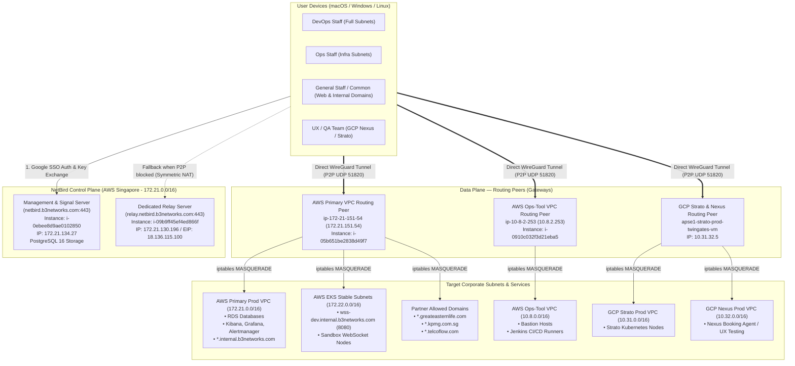

# NetBird — Infrastructure, Network & Access Configuration Reference

**Status:** Active Production  
**Last Verified:** 2026-09-25 (Verified live via AWS SSM on `i-0ebee8d9ae0102850`)  
**Managed by:** TechOps / DevOps  
**Dashboard:** `https://netbird.b3networks.com`

---

## 1. Background

- NetBird is B3 Networks' self-hosted Zero Trust Network Access (ZTNA) platform built on top of the WireGuard mesh overlay protocol.
- It completely replaces legacy static VPNs (`wg-easy`, OpenVPN) and Squid HTTP/SOCKS proxies for internal and partner corporate access.
- NetBird operates on a strict **Default-Deny** zero-trust model: no network path, port, or subnet is reachable unless explicitly defined as a Resource and granted by an Access Control Policy.
- This document serves as the authoritative technical reference for all NetBird server components, Docker Compose stacks, database storage, routing peers, VPC subnets, DNS wildcard routing, and access control policies.

---

## 2. Objective

- Provide an unambiguous architectural blueprint of the NetBird self-hosted cluster (Management, Signal, Dedicated Relay, and Routing Peers).
- Detail verified host configurations, Docker Compose specifications, and Linux kernel requirements.
- Document all active corporate Networks, Resources (Subnet CIDRs vs. Wildcard Domains), and Group Access Policies across AWS and GCP.
- Detail Security Group rules, firewall ports, health checks, and record critical architectural decisions (e.g., elimination of legacy proxy domains).

---

## 3. High-Level Architecture & Traffic Topology

NetBird establishes an encrypted WireGuard mesh overlay network where each connected peer receives an overlay IP within the `100.x.x.x` carrier-grade NAT range. Routing Peers act as internal gateways to forward traffic into private AWS and GCP subnets via Linux kernel NAT masquerading.



---

## 4. Control Plane Infrastructure (Management & Relay)

### 4.1 Server Inventory

| Component | Instance ID | Private IP | Public IP | Instance Type | OS / Kernel | DNS Endpoint |
|---|---|---|---|---|---|---|
| **Management + Signal** | `i-0ebee8d9ae0102850` | `172.21.134.27` | `13.250.164.169` | `t4g.medium` (ARM64) | Amazon Linux 2023 | `netbird.b3networks.com` |
| **Relay Server** | `i-09b9ff45ef4ed866f` | `172.21.130.196` | `18.136.115.100` | `t4g.medium` (ARM64) | Amazon Linux 2023 | `relay.netbird.b3networks.com` |

---

### 4.2 Management Server Configuration

* **Working Directory:** `/home/ec2-user/`
* **Configuration File:** `/home/ec2-user/config.yaml`
* **Storage Engine:** **PostgreSQL 16** (`postgres:16` container, database `netbird`)
* **Internal Docker Subnet:** `172.30.0.0/24` (Traefik Gateway: `172.30.0.10`)

#### Verified Docker Compose Stack (`/home/ec2-user/docker-compose.yml`)

| Container Name | Image Tag | Purpose | Exposed / Mapped Ports |
|---|---|---|---|
| `netbird-traefik` | `traefik:v3.6` | Reverse proxy, TLS via Let's Encrypt, gRPC h2c stream routing | `80:80/tcp`, `443:443/tcp` |
| `netbird-server` | `netbirdio/netbird-server:latest` | Combined Management API & Signal coordinator | `3478:3478/udp` (STUN), internal port 80 |
| `netbird-postgres` | `postgres:16` | Relational database storage engine (`POSTGRES_DB: netbird`) | `5432/tcp` (internal docker network only) |
| `netbird-proxy` | `netbirdio/reverse-proxy:latest` | WireGuard reverse proxy exposing internal resources | `51820:51820/udp`, `8443/tcp` (TLS passthrough) |
| `netbird-dashboard` | `netbirdio/dashboard:latest` | Web Management Dashboard UI | Internal HTTP via Traefik |
| `netbird-crowdsec` | `crowdsecurity/crowdsec:v1.7.7` | Security log monitoring & brute-force defense | Internal healthcheck |

#### Critical `config.yaml` Parameters (Verified Live)

```yaml
server:
  listenAddress: ":80"
  exposedAddress: "https://netbird.b3networks.com:443"
  stunPorts:
    - 3478
  metricsPort: 9090
  healthcheckAddress: ":9000"
  logLevel: "info"
  logFile: "console"

  authSecret: "<AUTH_SECRET_HASH>"
  dataDir: "/var/lib/netbird"

  auth:
    issuer: "https://netbird.b3networks.com/oauth2"
    signKeyRefreshEnabled: true
    dashboardRedirectURIs:
      - "https://netbird.b3networks.com/nb-auth"
      - "https://netbird.b3networks.com/nb-silent-auth"
    cliRedirectURIs:
      - "http://localhost:53000/"

  reverseProxy:
    trustedHTTPProxies:
      - "172.30.0.10/32"

  store:
    engine: "postgres"
    postgresConnection: "host=netbird-postgres port=5432 dbname=netbird user=netbird password=<POSTGRES_PASSWORD> sslmode=disable"
    encryptionKey: "<ENCRYPTION_KEY>"

  stuns:
    - uri: "stun:stun.l.google.com:19302"
      proto: "udp"

  relays:
    addresses:
      - "rels://relay.netbird.b3networks.com:443"
    credentialsTTL: "12h"
    secret: "<MATCHES_AUTH_SECRET>"
```

> [!IMPORTANT]
> **Key Configuration Directives:**
> 1. **Storage Engine:** Configured to `postgres` pointing to `netbird-postgres:5432`. SQLite is deprecated and not in use.
> 2. **STUN Configuration:** Google STUN (`stun:stun.l.google.com:19302`) is explicitly configured to bypass NetBird Bug [#6324](https://github.com/netbirdio/netbird/discussions/6324), where the embedded STUN server silently drops UDP binding requests.
> 3. **External Relay Binding:** Local embedded relay is disabled (`Relay: false`). All fallback relay traffic is routed to the dedicated relay instance via `rels://relay.netbird.b3networks.com:443`.
> 4. **Secret Parity:** `relays.secret` on the management node **must exactly match** `NB_AUTH_SECRET` on the relay server.
> 5. **Automated Backup:** Cron job executes daily at 02:00:  
>    `0 2 * * * /home/ec2-user/backup-netbird.sh >> /var/log/netbird-backup.log 2>&1`

---

### 4.3 Relay Server Configuration

* **Working Directory:** `/home/ec2-user/`
* **Docker Service:** `netbirdio/relay:latest`

```yaml
services:
  relay:
    image: netbirdio/relay:latest
    container_name: netbird-relay
    restart: unless-stopped
    ports:
      - '443:443'
      - '80:80'
    environment:
      - NB_LOG_LEVEL=info
      - NB_LISTEN_ADDRESS=:443
      - NB_EXPOSED_ADDRESS=rels://relay.netbird.b3networks.com:443
      - NB_AUTH_SECRET=<MATCHES_MANAGEMENT_SECRET>
      - NB_LETSENCRYPT_DOMAINS=relay.netbird.b3networks.com
      - NB_LETSENCRYPT_EMAIL=devops@b3networks.com
      - NB_LETSENCRYPT_DATA_DIR=/data/letsencrypt
    volumes:
      - relay_data:/data
```

| Port | Protocol | Purpose |
|---|---|---|
| `443` | TCP / WebSocket | Encrypted Relay tunnel when symmetric NAT blocks direct WireGuard P2P UDP. |
| `3478` | UDP | STUN discovery for peer ICE negotiation. |
| `80` | TCP | Let's Encrypt HTTP-01 challenge verification. |

---

### 4.4 Database & Automated Backup System (On-Call DevOps Runbook)

When the primary administrator is on leave or out-of-office, DevOps team members on-call can verify and manage the NetBird database backups using the following instructions.

#### 1. Backup Specifications
* **Database Engine:** PostgreSQL 16 (`netbird-postgres`)
* **Schedule:** Daily at **02:00 AM** (Cron: `0 2 * * *`)
* **Retention Policy:** **7 days** (automated cleanup via `find ... -mtime +7 -delete`)
* **Backup Destination:** `/home/ec2-user/backups/`
* **Log Location:** `/var/log/netbird-backup.log`
* **File Naming Format:** `netbird_YYYYMMDD_HHMMSS.sql` (average size: ~440KB - 630KB)

#### 2. Backup Script Reference (`/home/ec2-user/backup-netbird.sh`)

```bash
#!/bin/bash
DATE=$(date +%Y%m%d_%H%M%S)
BACKUP_DIR="/home/ec2-user/backups"
mkdir -p $BACKUP_DIR

# Backup PostgreSQL
docker exec netbird-postgres pg_dump -U netbird netbird > $BACKUP_DIR/netbird_$DATE.sql

# Keep only last 7 days
find $BACKUP_DIR -name "*.sql" -mtime +7 -delete

echo "Backup done: netbird_$DATE.sql"
```

#### 3. On-Call Quick Verification Checklist

DevOps engineers can verify backup health in under 30 seconds:

```bash
# Step 1: Check if last night's backup ran successfully
tail -n 10 /var/log/netbird-backup.log
# Expected output: "Backup done: netbird_YYYYMMDD_02000X.sql"

# Step 2: List current backup files and check file sizes (~400KB - 650KB)
ls -lh /home/ec2-user/backups

# Step 3: Trigger a manual backup (e.g. before major config or upgrade operations)
/home/ec2-user/backup-netbird.sh

# Step 4: Verify PostgreSQL database records without downtime
docker exec -i netbird-postgres psql -U netbird -d netbird -c "SELECT COUNT(*) AS active_peers FROM peers; SELECT COUNT(*) AS total_users FROM users;"
```

---

## 5. Security Groups & Firewall Ports Reference

To ensure connectivity and avoid troubleshooting delays, the following inbound rules must be configured in AWS Security Groups and GCP Firewall:

| Server / Role | Protocol | Port Range | Source / Destination | Purpose |
|---|:---:|:---:|---|---|
| **Management Server** (`172.21.134.27`) | TCP | `80`, `443` | `0.0.0.0/0` (or Cloudflare IP list) | Web UI, OAuth2, gRPC management stream |
| | UDP | `3478` | `0.0.0.0/0` | STUN binding requests |
| | UDP | `51820` | `0.0.0.0/0` | NetBird reverse proxy WireGuard port |
| | TCP | `9000`, `9090` | `172.21.0.0/16` | Internal Prometheus metrics & healthcheck |
| **Relay Server** (`172.21.130.196`) | TCP | `443` | `0.0.0.0/0` | Encrypted WebSocket Relay fallback |
| | UDP | `3478` | `0.0.0.0/0` | STUN discovery |
| | TCP | `80` | `0.0.0.0/0` | Let's Encrypt HTTP-01 verification |
| **Routing Peers (All)** | UDP | `51820` | `0.0.0.0/0` | Direct WireGuard P2P connection from client laptops |
| **Target AWS Instances** (e.g. `wss-dev`) | TCP | e.g. `8080`, `3306` | `172.21.151.54/32` (or VPC CIDR) | Application ingress from routing peer NAT |

---

## 6. Routing Peers (Network Gateways)

Routing peers act as network bridges between the WireGuard overlay network (`100.x.x.x`) and target private VPCs/subnets.

### 6.1 Routing Peer Inventory

| Hostname / Node Name | Platform / Region | Instance ID / Private IP | Forwarded Subnets / CIDRs | Masquerade (NAT) |
|---|---|---|---|:---:|
| **`netbird-routing-peer-hoiio`**<br>(`ip-172-21-151-54`) | AWS Singapore<br>(`ap-southeast-1`) | `i-05b651be2838d49f7`<br>`172.21.151.54` | • `172.21.0.0/16` (Primary Prod VPC)<br>• `172.22.0.0/16` (EKS Stable / wss-dev)<br>• `172.23.0.0/16` (Secondary Prod VPC)<br>• Partner Wildcard Domains | **Enabled** |
| **`netbird-routing-peer-ops`**<br>(`ip-10-8-2-253`) | AWS Singapore<br>(`ap-southeast-1`) | `i-0910c032f3d21eba5`<br>`10.8.2.253` (EIP: `18.140.112.255`) | • `10.8.0.0/16` (Ops-Tool VPC) | **Enabled** |
| **`apse1-strato-prod-twingates-vm`** | GCP Singapore<br>(`asia-southeast1`) | GCP VM<br>`10.31.32.5` | • `10.31.0.0/16` (GCP Strato Prod)<br>• `10.32.0.0/16` (GCP Nexus Prod) | **Enabled** |
| **`routing-peer-exp-172.28`** | AWS Singapore<br>(`ap-southeast-1`) | `vpc-06c6ea0fc33bbe767`<br>`172.28.x.x` | • `172.28.0.0/16` (B3-EXP Experimental VPC) | **Enabled** |

---

### 6.2 Host System Prerequisites for Routing Peers

Every Linux instance acting as a NetBird Routing Peer must have kernel IP forwarding enabled and `iptables` installed:

```bash
# 1. Enable IPv4 packet forwarding in kernel
sudo sysctl -w net.ipv4.ip_forward=1
echo "net.ipv4.ip_forward = 1" | sudo tee /etc/sysctl.d/99-netbird.conf
sudo sysctl -p /etc/sysctl.d/99-netbird.conf

# 2. Ensure iptables package is installed (NetBird manages the NETBIRD-RT-NAT chain)
sudo dnf install -y iptables || sudo apt-get install -y iptables

# 3. Connect to Management server using Setup Key
sudo netbird up \
  --management-url https://netbird.b3networks.com \
  --setup-key <SETUP_KEY_FROM_DASHBOARD>

# 4. Verify NAT Masquerade rule is populated
sudo iptables -t nat -L NETBIRD-RT-NAT -n -v
```

> [!NOTE]
> **Masquerade (NAT) Function:** NetBird applies `MASQUERADE` on the routing peer's egress interface. Destination target instances (e.g., RDS databases, EKS pods) see incoming requests originating from the Routing Peer's private IP (`172.21.151.54`, `10.8.2.253`, or `10.31.32.5`), eliminating the need to modify route tables or security groups across the entire VPC.

---

## 7. Dashboard Configuration: Networks & Resources

NetBird networks and resources are managed in the Web Dashboard under **Networks**.

### 7.1 Active Corporate Networks Table

| Network Name | Routing Peer | Resources (Domains / CIDRs) | Assigned Groups | Operational Purpose |
|---|---|---|---|---|
| **`b3 internal resources`** | `ip-172-21-151-54` | `*.internal.b3networks.com` | `Common` | Corporate internal web tooling (Kibana, Grafana, JIT, Alertmanager, Jenkins) and internal WebSocket services (`wss-dev`). |
| **`b3 partner resources`** | `ip-172-21-151-54` | `*.greateasternlife.com`<br>`*.kpmg.com.sg`<br>`*.telcoflow.com` | `B3-Partner` | Split-tunnel egress for third-party enterprise partner integrations. *(See Section 7.2 for removed domains)*. |
| **`gcp-strato-prod`** | `apse1-strato-prod-twingates-vm` | `10.31.0.0/16` | `DevOps` | Production Kubernetes worker nodes and database instances in GCP Strato. |
| **`gcp-nexus-prod`** | `apse1-strato-prod-twingates-vm` | `10.32.0.0/16` | `nexus-ux-team`, `DevOps` | Production Nexus environment for automated booking agent QA and testing. |
| **`ops-tool`** | `ip-10-8-2-253` | `10.8.0.0/16` | `Ops`, `DevOps` | Bastion jump hosts, Jenkins CI/CD runners, and infrastructure management tooling. |

---

### 7.2 Key Architectural Decisions & Lessons Learned

#### 1. Wildcard Domain Routing vs. Static IP Subnets
* **Domain Routing (`*.internal.b3networks.com`):** When a user requests an internal domain (e.g. `wss-dev.internal.b3networks.com`), NetBird intercepts the DNS query locally, resolves the target IP (`172.22.11.10`) via the AWS Route53 private hosted zone, and dynamically injects a temporary single-host route into the client's routing table.
* **Benefit:** Eliminates the administrative overhead of manually configuring individual static CIDRs for every internal service or microservice.

#### 2. Critical Removal of `*.b3networks.com` and `*.gstatic.com`
During the migration from legacy Squid proxy to NetBird, two domains were initially carried over but caused production incidents and were permanently **deleted**:

> [!WARNING]
> **Why `*.b3networks.com` must NEVER be added to NetBird:**
> - Matching the company's root wildcard `*.b3networks.com` caused NetBird to intercept **ALL** corporate public endpoints (such as `api.b3networks.com`, `portal.b3networks.com`, and `chat02.b3networks.com`).
> - Instead of resolving to public Cloudflare/ALB VIPs, traffic was forcefully routed through internal AWS routing peers, where split-horizon DNS resolved them to internal private IPs that blocked public traffic.
> - **Rule:** Internal domains must use `*.internal.b3networks.com`. Public domains must go directly over the Internet.

> [!NOTE]
> **Why `*.gstatic.com` was removed:**
> - In the legacy Squid HTTP/SOCKS proxy, browsers failed to load Google Fonts and UI icons unless `*.gstatic.com` was whitelisted.
> - NetBird is a WireGuard layer-3 split-tunnel VPN, not an HTTP proxy. Routing public Google CDN assets through corporate VPN tunnels introduced unnecessary latency and bandwidth waste.

---

## 8. Access Control Policy & Group Matrix

NetBird enforces a **Default-Deny** security posture. Traffic between peer groups is blocked unless permitted by an active policy:

| Policy Name | Source Group | Destination Group / Resource | Protocol & Ports | Purpose |
|---|---|---|:---:|---|
| **`Common-Internal-Access`** | `Common` | `*.internal.b3networks.com` | `ALL` | Grants all B3 Google SSO authenticated staff access to internal web tools and WebSocket dev. |
| **`DevOps-Full-Mesh`** | `DevOps` | `DevOps`, AWS & GCP Subnets | `ALL` | Full administrative access to `172.21.0.0/16`, `172.22.0.0/16`, `10.8.0.0/16`, `10.31.0.0/16`, `10.32.0.0/16`. |
| **`Ops-Infra-Access`** | `Ops` | `172.21.0.0/16`, `10.8.0.0/16` | `ALL` | TechOps access to AWS Primary VPC and Ops-tool VPC infrastructure. |
| **`Nexus-Team-Access`** | `nexus-ux-team` | `10.32.0.0/16` (`gcp-nexus-prod`) | `ALL` | QA and UX testers testing Nexus booking agent services. |
| **`Partner-Routing`** | `B3-Partner` | `b3 partner resources` | `ALL` | Partner integration route access. |
| **`Route Access`** | `Common`, `DevOps`, `Ops`, `nexus-ux-team` | `Routing Peers` | `ALL` | **Mandatory:** Allows client nodes to receive subnet route advertisements from routing peers. |

---

## 9. Operational & Troubleshooting Cheatsheet

### 9.1 Server Operations (Management & Relay)

```bash
# Verify Management Docker stack
docker ps --format "table {{.Names}}\t{{.Status}}\t{{.Ports}}"

# Check Management Server logs
docker logs netbird-server 2>&1 | tail -n 30

# Verify External Relay binding
docker logs netbird-server 2>&1 | grep -i relay
# Expected output: Relay: false, Relay addresses: [rels://relay.netbird.b3networks.com:443]

# Verify Relay TLS certificate
curl -v https://relay.netbird.b3networks.com/
# Expected: HTTP 404 page not found + SSL certificate verify ok

# Check automated backup log
tail -n 20 /var/log/netbird-backup.log
```

---

### 9.2 Client Operations (Verification & Cache Reset)

#### macOS Client (Terminal)

```bash
# 1. View client connection status and peer count
netbird status --detail

# 2. View selected/active networks and resolved IPs
netbird networks list

# 3. Cleanly refresh network route table
netbird networks deselect all
netbird networks select all

# 4. Full daemon restart to flush route cache
netbird down && netbird up

# 5. Test internal DNS resolution and endpoint reachability
curl -Iv http://wss-dev.internal.b3networks.com:8080
```

#### Windows Client (PowerShell / GUI)

```powershell
# 1. GUI Method:
# Click NetBird icon in System Tray (near taskbar clock) -> Toggle Disconnect -> Wait 3s -> Toggle Connect.

# 2. PowerShell CLI:
netbird down; netbird up

# 3. Re-select networks:
netbird networks deselect all
netbird networks select all

# 4. Restart Windows NetBird Service (Administrative PowerShell):
Restart-Service NetBird
```

---

# Contact Points

- TechOps
  - Levi Nguyen (levinguyen@b3networks.com)
  - Luk Huynh (luk@b3networks.com)
- DevOps
  - Hieu Dao
  - Sang Ngo
  - Vinh Dang
  - Huy Nguyen
