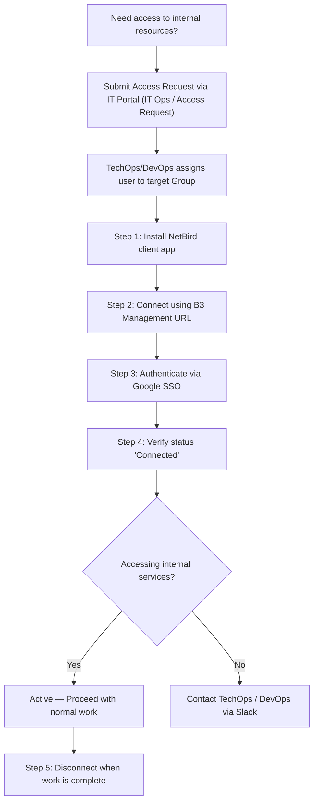

# NetBird — End-User Connection & Setup Guide

**Status:** Active  
**Last Updated:** 2026-09-25  
**Target Audience:** All B3 Networks staff, developers, and contractors requiring internal network access.  
**Management URL:** `https://netbird.b3networks.com`

---

> [!NOTE]
> **Summary:** NetBird is B3 Networks' Zero Trust corporate VPN. Unlike legacy VPNs, you do **not** need any configuration files (`.ovpn`, `.conf`) or static certificates. Authentication is handled seamlessly through your corporate Google Workspace account (`@b3networks.com`).

---

## 1. Onboarding Flowchart



---

## 2. Step 1: Install NetBird Client

Choose your operating system below:

### macOS
* **Homebrew (Recommended):**
  ```bash
  brew install netbirdio/tap/netbird
  ```
* **Or Download `.pkg` Installer:**
  Download the latest macOS installer from [NetBird Official Releases](https://github.com/netbirdio/netbird/releases/latest).

---

### Windows
1. Download the Windows `.exe` installer from [NetBird Official Releases](https://github.com/netbirdio/netbird/releases/latest).
2. Run the installer and follow the on-screen prompts.
3. The NetBird icon will appear in your Windows System Tray (near the clock at the bottom-right).

---

### Linux (Ubuntu / Debian / RHEL)
```bash
curl -fsSL https://pkgs.netbird.io/install.sh | sh
```

---

### iOS & Android
* Search for **NetBird** on Apple App Store or Google Play Store.

---

## 3. Step 2: Connect to B3 NetBird Server

> [!IMPORTANT]
> **Crucial Requirement:** You must explicitly specify B3's private management URL:  
> **`https://netbird.b3networks.com`**  
> If omitted, the client will connect to NetBird's public cloud instead of B3 corporate infrastructure.

### Option A: Using Terminal / Command Line (macOS / Linux / Windows)

* **macOS / Linux:**
  ```bash
  netbird up --management-url https://netbird.b3networks.com
  ```

* **Windows Command Prompt / PowerShell (Run as Administrator):**
  ```powershell
  netbird up --management-url https://netbird.b3networks.com
  ```

---

### Option B: Using Graphical UI (Windows / macOS)
1. Open the NetBird application.
2. Click on **Settings** (Gear Icon).
3. In **Management URL**, enter: `https://netbird.b3networks.com`
4. Click **Save** and then click **Connect**.

---

## 4. Step 3: Authenticate with Google SSO

1. Upon executing the connect command or clicking Connect, your default web browser will open automatically.
2. Click **Login with Google**.
3. Select your corporate **`@b3networks.com`** email account.
4. Once authenticated, your browser will display a success message and your terminal or app will indicate **`Connected`**.

---

## 5. Step 4: Verify Connection & Access

### Verify Connection Status
```bash
netbird status
```
Expected output:
* **Management:** `Connected`
* **Signal:** `Connected`
* **Peers count:** `X/X Connected`

### Test Internal Services
Open the following URLs in your browser to verify access:
* **Kibana:** `https://kibana.internal.b3networks.com`
* **Grafana:** `https://grafana.internal.b3networks.com`
* **Alertmanager:** `https://alertmanager.internal.b3networks.com`
* **Internal WebSockets (for Dev/QA):** `ws://wss-dev.internal.b3networks.com:8080`

---

## 6. Step 5: Disconnect

* **CLI:**
  ```bash
  netbird down
  ```
* **GUI (Windows / macOS):**
  Right-click the NetBird icon in your system tray / menu bar $\rightarrow$ Click **Disconnect**.

---

## 7. Troubleshooting & FAQ

### Q1: VPN shows "Connected" but I cannot reach internal domains?
**A:** Your DNS route cache may be stale. Refresh your routes:

* **macOS:**
  ```bash
  netbird down && netbird up
  netbird networks select all
  ```
* **Windows (GUI):**
  Right-click the NetBird icon in the bottom-right taskbar $\rightarrow$ Toggle **Disconnect** $\rightarrow$ Wait 3 seconds $\rightarrow$ Toggle **Connect**.
* **Windows (PowerShell):**
  ```powershell
  netbird down; netbird up
  ```

### Q2: On Windows, why does `netbird down && netbird up` give an error?
**A:** Default Windows PowerShell does not support the bash `&&` chaining operator. Use a semicolon `;` instead:
```powershell
netbird down; netbird up
```

### Q3: I see "User Approval Pending" after logging in?
**A:** Your device has registered, but your user account requires initial group assignment by TechOps. Notify TechOps in the Slack `#techops-support` channel.

### Q4: Can I use NetBird on multiple devices simultaneously?
**A:** Yes. Unlike legacy WireGuard, NetBird supports concurrent active connections across your laptop and mobile devices.

---

# Contact Points

- TechOps
  - Levi Nguyen (levinguyen@b3networks.com)
  - Luk Huynh (luk@b3networks.com)
- DevOps
  - Hieu Dao
  - Sang Ngo
  - Vinh Dang
  - Huy Nguyen
